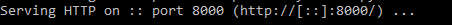

### Introduction:

Hi. I am [Vinayak Vineeth](https://github.com/TheIcyColdPenguin) from grade 11, Whitefield Global School, Bangalore. I have a keen interest in developing programs in the following languages:

-   Python
-   JavaScript
-   Java (along with the Processing framework)

Here, I am presenting an app that allows one to generate cycloids (in particular, [epicycloids]) based on specified parameters.

---

[epicycloids]: https://en.wikipedia.org/wiki/Epicycloid

### Program Overview:

The program functions similar to a [spirograph]; however, instead of a single continuous line, it uses many separate lines that forms the illusion of curved lines.  
It works by plotting lines between specific points on the circumference of a circle in order to form the silhouette of a cycloid.

The program consists of:

-   A drawing canvas
-   A menu sidebar
    -   Checkbox that toggles animation
    -   Sliders to adjust the parameters for drawing the cycloid

This project was created using HTML and JavaScript with the help of the [p5.js] library.

<br />


---

[spirograph]: https://en.wikipedia.org/wiki/Spirograph
[p5.js]: https://p5js.org

#### This image illustrates the manner in which the program works-


---

### More about Cycloids-

A cycloid is the curve traced by a point on a circle as it rolls along a straight line without slipping.  
An epicycloid is the curve traced by a circle as it rolls on the outside of the circumference of another circle.

#### Fun facts about cycloids-

-   A special kind of cyloid, called the brachistochrone curve, is the quickest path between two points when only under the influence of gravity.  
    

---

#### [Epicycloid]() examples:

-   [Cardioid] :<br />
-   [Nephroid]:<br />

---

[epicycloid]: https://en.wikipedia.org/wiki/Epicycloid
[cardioid]: https://en.wikipedia.org/wiki/Cardioid
[nephroid]: https://en.wikipedia.org/wiki/Nephroid

### How It Works(Source):

-   #### index.html:
    -   It is the entry point of the program. It serves the JavaScript files for the browser to run.
-   #### sketch.js:
    -   It is the main JavaScript file that controls the look of the web page.
    -   This file handles the color scheme and drawing of the background and menu.
    -   It also manages the events trigerred by the interactive elements on the page.
    -   The image received from Cycloid.js is displayed synchronously.
-   #### Cycloid.js:
    -   It is the supplementary file that controls the logic for drawing the cycloid.
    -   This file houses the algorithm that decides which points to connect in order to form the right shape.
    -   It then creates an image of the same, and sends it to sketch.js to display.


---

### How It Works(Interface):

-   When the page is launched, the drawing is displayed with the default values.
-   These values can be changed using the sliders.


### Controls:

##### There are three sliders and one checkbox for the user to interact with:

###### Checkbox:

-   It toggles between animation and static mode.
    -   When in animation mode, the program draws only one line at a time.
    -   When in static mode, the program displays the entire drawing in one go.

###### Slider(Radius):

-   It changes the radius of the circle in which the diagram is drawn.
-   The minimum value is 50 pixels, while the maximum value is 500.
    -   It should be noted that if a circle with a radius of 500 pixels extends past the edges of the screen, the program will lower the maximum possible value of the slider.
-   The default value is 250 pixels, except if the screen is too small (refer previous point).

###### Slider(Multiplier):

-   It allows the multiplier for the pencil drawing to be changed.
-   The allowed range is 2 to 360, and the default value is 2.

###### Slider(Rotation):

-   It changes the orientation of the drawing, in real time.
-   It allows a range of values from 0&deg; to 360&deg;, the default being 0&deg;.

---

### Prerequisites:

-   The folder can be downloaded [here]()-
-   To get the program running on other devices, a local server is required.
-   [Python](https://www.python.org/downloads/release/python-385/ "Download Python here") is recommended, but other software can also be used (Note: This documentaion only covers python).
-   First, open a terminal and `cd` to the folder in which the project files are contained.
-   Next, check the version of python being used with the command-
    ```
    python -V
    ```
-   If the version shown is `2.x.x`, execute the following command-
    ```
    python -m SimpleHTTPServer
    ```
-   If the version is `3.x.x`, execute this command instead-
    ```
    python -m http.server
    ```
-   That's it! It should now display output similar to the following-<br />
    <br /><br /><br />
-   Now open a web browser and go to the URL-
    ```
    http://localhost:PORT_NUMBER
    ```
    where the `PORT_NUMBER` is shown in the output of the command line where the server was created.  
    Note: Make sure there are no spaces in the URL.

---

<h3 id="references-">References:</h3>
<table align="left">
<thead>
<tr>
<th style="text-align:left"></th>
<th style="text-align:left">Topic</th>
<th style="text-align:left">Link</th>
</tr>
</thead>
<tbody>
<tr>
<td style="text-align:left">1.</td>
<td style="text-align:left">Download Folder</td>
<td style="text-align:left"><a href="new_link_here">new_link_here</a></td>
</tr>
<tr>
<td style="text-align:left">1.</td>
<td style="text-align:left">Github Repository</td>
<td style="text-align:left"><a href="https://github.com/TheIcyColdPenguin/Competion-Project-Cycloid">https://github.com/TheIcyColdPenguin/Competion-Project-Cycloid</a></td>
</tr>
<tr>
<td style="text-align:left">2.</td>
<td style="text-align:left">Download Python</td>
<td style="text-align:left"><a href="https://www.python.org/downloads/release/python-385/">https://www.python.org/downloads/release/python-385/</a></td>
</tr>
<tr>
<td style="text-align:left">3.</td>
<td style="text-align:left">p5.js</td>
<td style="text-align:left"><a href="https://p5js.org">https://p5js.org</a></td>
</tr>
<tr>
<td style="text-align:left">3.</td>
<td style="text-align:left">Epicycloid</td>
<td style="text-align:left"><a href="https://en.wikipedia.org/wiki/Epicycloid">https://en.wikipedia.org/wiki/Epicycloid</a></td>
</tr>
<tr>
<td style="text-align:left">4.</td>
<td style="text-align:left">Spirograph</td>
<td style="text-align:left"><a href="https://en.wikipedia.org/wiki/Spirograph">https://en.wikipedia.org/wiki/Spirograph</a></td>
</tr>
<tr>
<td style="text-align:left">5.</td>
<td style="text-align:left">Cardioid</td>
<td style="text-align:left"><a href="https://en.wikipedia.org/wiki/Cardioid">https://en.wikipedia.org/wiki/Cardioid</a></td>
</tr>
<tr>
<td style="text-align:left">6.</td>
<td style="text-align:left">Nephroid</td>
<td style="text-align:left"><a href="https://en.wikipedia.org/wiki/Nephroid">https://en.wikipedia.org/wiki/Nephroid</a></td>
</tr>
</tbody>
</table>
